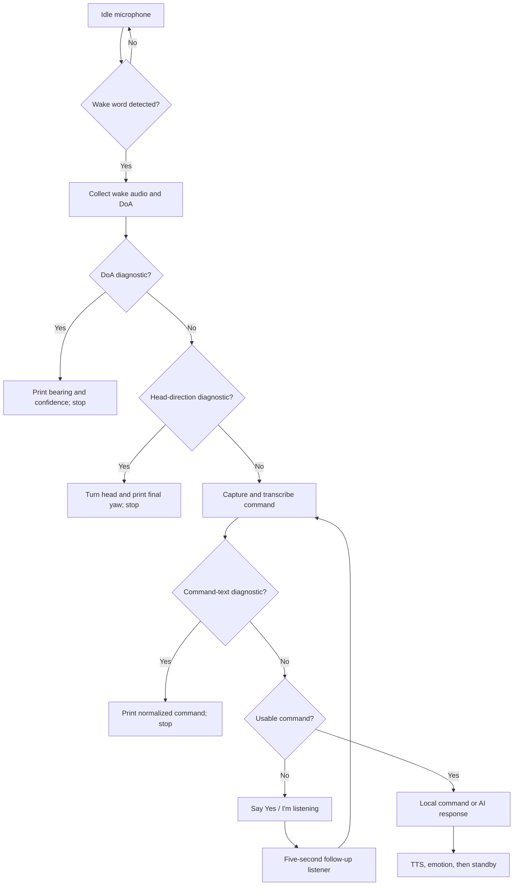

# Ezra Short Test Plan

Run these tests in order. Change only the listed flags for each test, restart
Ezra after changing them, and save the terminal output. Do not enable more than
one `ENABLE_*_DIAGNOSTIC` flag at a time.

## Interaction flow



## Before each test

1. Start in a quiet room with Ezra facing forward.
2. Use the same speaker position and phrase for repeatability.
3. Say: **"Hey Ezra, what time is it?"**
4. Repeat three times from center, 45 degrees left, and 45 degrees right.
5. Record whether the result is repeatable, not merely whether one attempt works.

## Test 1: Wake detection only

Configuration:

```python
ENABLE_DOA_DIAGNOSTIC = True
ENABLE_COMMAND_TEXT_DIAGNOSTIC = False
ENABLE_HEAD_DIRECTION_DIAGNOSTIC = False
ENABLE_SOUND_GAZE = False
```

Purpose: Test wake detection, ReSpeaker VAD, and direction measurement without
STT, TTS, or servo movement. Diagnostic face lock holds the eyes and eyelids
stationary after their initial startup position.

Pass criteria:

- Exactly one `ITEM TEST 1` result appears for each wake phrase.
- Center is near 0 degrees; left and right have the correct sign.
- Results say `QUALIFIED`, with no `Errno 19` or device-disconnect messages.
- Three readings at one position are reasonably close (target: within 20 degrees).

If this fails, stop here. The problem is in microphone/VAD/DoA acquisition or
microphone orientation, not head motion or command processing.

## Test 2: Head movement

Configuration:

```python
ENABLE_DOA_DIAGNOSTIC = False
ENABLE_COMMAND_TEXT_DIAGNOSTIC = False
ENABLE_HEAD_DIRECTION_DIAGNOSTIC = True
```

Purpose: Add head-servo movement to the already verified wake and DoA path.
Unlike the isolated microphone and transcription diagnostics, this test keeps
normal idle eye movement and blinking enabled so it exercises the production
servo-noise suppression path.

Pass criteria:

- The head turns toward the tested side and reports a matching final yaw.
- Center speech stays within the configured deadband.
- No `Clamping unreachable ...` message occurs for speakers in front.
- The ReSpeaker remains connected after every movement.

If Test 1 passes but Test 2 causes `Errno 19`, ALSA capture errors, or USB loss,
investigate servo power, grounding, electrical noise, and USB stability.

## Test 3: Command transcription

Configuration:

```python
ENABLE_DOA_DIAGNOSTIC = False
ENABLE_COMMAND_TEXT_DIAGNOSTIC = True
ENABLE_HEAD_DIRECTION_DIAGNOSTIC = False
```

Purpose: Test capture, silence detection, STT, and wake-word stripping without
executing a command or speaking a response.

Test phrases:

- `Hey Ezra, what time is it?` -> `what time is it`
- `Ezra, tell me a joke` -> `tell me a joke`
- `Hey Ezra` -> wake-only behavior; no invented command

Pass criteria: the printed normalized command matches the spoken command on at
least two of three attempts for each phrase.

## Test 4: Wake-only follow-up

Turn all diagnostic flags off.

1. Say only `Hey Ezra`.
2. Confirm the head turns, then Ezra promptly says `Yes?` or `I'm listening.`
3. During the follow-up window, say `what time is it?` without a wake word.
4. Repeat, but say `Hey Ezra` during the follow-up window, pause, then give the
   command. The repeated wake word should reset listening rather than end it.
5. Repeat once with no follow-up. Ezra should return to standby after five seconds.

## Test 5: Full interaction

Keep all diagnostic flags off. Test one local command and one AI command:

- `Hey Ezra, what time is it?`
- `Hey Ezra, explain why the sky is blue.`

Pass criteria: wake, direction, command capture, response, mouth motion, and
return to standby all complete without device errors.

## Test 6: Idle behavior

Keep all diagnostic flags off and do not speak for one minute.

Pass criteria:

- Natural standby eye movement and blinking continue.
- Eyelid servo noise does not produce `Looking toward speaker` messages.
- A real voice from the left or right can still trigger an eye-only sound gaze.

## Failure record

### Test run results (reported August 4, 2026)

| Test | Result | Observation |
|---|---|---|
| 3 | Pass | Command transcription test passed. |
| 4 | Pass after fixes | Wake-only follow-up works after stop-guard and ReSpeaker reconnect changes. Earlier runs had false `Stop` detections and repeated `[Errno 19] No such device` errors. |
| 5 | Pass after fixes | Full interaction passed after switching runtime STT from hardcoded `base.en` to configured `small.en`, enabling beam search, and adding command-oriented decoding context. |
| 6 | Pass after fixes | Natural idle eye movement and blinking work, eyelid noise does not cause false gaze, and left/right voices trigger eye-only sound gaze. |

Tests 3–6 pass after the stop guard, ReSpeaker reconnect, post-capture head
movement, STT accuracy, and ambient sound-gaze fixes.

Post-test regression fixes:

- Cached wake acknowledgement audio now accepts filesystem paths during mouth sync.
- Declining a wake-only follow-up with `no` or a similar phrase returns to standby.
- Noise/filler-only follow-ups such as `pfft`, `um`, or `hmm` are not sent to GPT.
- Unknown wake-only follow-up commands require at least two words; direct
  wake-and-command phrases are unaffected.
- Wake-only head turns require stronger DoA confidence; uncertain bearings wait
  for the longer follow-up command before turning.
- Eye and eyelid servo-motion intervals are excluded from wake/command DoA;
  the listening pose remains mechanically still while direction is measured.
- Head turns require a dominant active-speech DoA cluster plus agreement from
  the most recent stable window; diagnostics print the confidence components.
- Entering sleep clears eye-gaze overrides, and ambient sound gaze is disabled
  while sleeping.

For each failure, save these five facts:

| Field | Record |
|---|---|
| Test number | Which stage failed |
| Exact phrase | What was spoken |
| Speaker position | Center, left, right, and approximate angle |
| Expected result | What should have happened |
| Terminal output | From `DETECTED` through the failure |

Change only one threshold or behavior between repeated runs. Return to the last
passing test whenever a later test fails.
